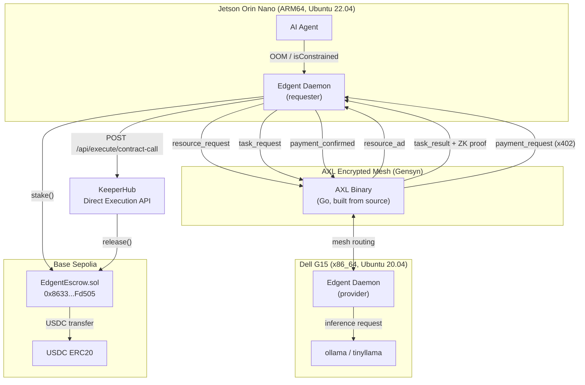

# Edgent

**When your agent runs out of compute, it finds more, pays for it, and finishes the job. No human. No cloud. No coordinator.**

Submitted to ETHGlobal Open Agents 2026.
Prize tracks: Gensyn AXL, KeeperHub, ENS.

Demo Video: https://youtu.be/OioOGf5Mkr4?si=P3PAlxA_XH79tt2C
Promo Video: https://youtu.be/Wwsi2bcCXcU?si=4yLAWRu984x1Kxbg

---

## Table of Contents

1. [The Problem](#the-problem)
2. [The Solution](#the-solution)
3. [AXL Integration](#axl-integration)
4. [KeeperHub Integration](#keeperhub-integration)
5. [ZK Proof System](#zk-proof-system)
6. [EdgentEscrow Smart Contract](#edgentescrow-smart-contract)
7. [ENS Integration](#ens-integration)
8. [End-to-End Flow](#end-to-end-flow)
9. [Architecture](#architecture)
10. [Tech Stack](#tech-stack)
11. [Setup](#setup)
12. [Repository Structure](#repository-structure)

---

## The Problem

Edge AI agents crash when they exhaust available RAM. The failure modes available today are limited to three options: crash and lose the task, queue and wait for local resources to free up, or route to a cloud provider that requires pre-configured accounts and credentials. Every option requires either human intervention or infrastructure that was set up in advance. Agents cannot recover autonomously from a resource constraint at runtime.

This is a fundamental gap in autonomous agent design. An agent operating at the edge -- on a Jetson, a Raspberry Pi, or any resource-constrained device -- has no mechanism to continue meaningful work when local compute is insufficient.

---

## The Solution

Edgent is a peer-to-peer compute delegation daemon for edge AI agents. It runs on any Linux machine as a background process alongside the agent. When the agent hits an OOM error or a resource constraint is detected, the daemon takes over without human involvement.

The recovery sequence is fully autonomous: the daemon broadcasts a resource request over the AXL encrypted mesh, selects a capable peer that responds with available capacity, stakes USDC into an escrow contract, delegates the inference task, receives the result with a ZK proof of output possession, verifies the proof, and releases payment via KeeperHub. The agent gets its result. The provider gets paid. No human touched anything after the initial wallet funding.

**Demo hardware:**
- Requesting node: NVIDIA Jetson Orin Nano, Ubuntu 22.04, ARM64
- Provider node: Dell G15 laptop, Ubuntu 20.04, x86_64
- Both machines are physically separate, communicating over real network interfaces.

---

## AXL Integration

AXL (Agent eXchange Layer) by Gensyn is the sole transport layer for all inter-node communication in Edgent. There is no HTTP between machines, no WebSocket, and no central broker. Every message type flows exclusively over the AXL encrypted mesh.

### Message Types

| Message | Direction | Purpose |
|---|---|---|
| `resource_request` | requester -> broadcast | Announce compute need to the mesh |
| `resource_ad` | provider -> requester | Respond with capabilities, wallet address, price |
| `task_request` | requester -> provider | Send prompt, model, and jobId after staking USDC |
| `task_result` | provider -> requester | Return inference output and ZK proof |
| `payment_request` | provider -> requester | x402 payment signal sent over AXL mesh |
| `payment_confirmed` | requester -> provider | Confirm KeeperHub payment executed onchain |

### x402 Payment Protocol over AXL

The x402 payment protocol is implemented over the AXL mesh rather than HTTP. After delivering the inference result, the provider sends a `payment_request` AXL message containing the output commitment. This is the x402 signal. The requester intercepts it, verifies the ZK proof, and triggers KeeperHub to release the escrow. All communication, including payment negotiation, remains inside the encrypted mesh. There is no outbound HTTP between the two nodes at any point in the payment flow.

### Binary and Process Model

AXL is built from source on each machine using Go. The Edgent daemon spawns the AXL binary as a child process at startup and communicates with it via localhost HTTP on port 9002. All mesh routing happens transparently through the AXL process. The Dell G15 runs as the bootstrap hub node. The Jetson Orin peers into it on startup.

### AXL Configuration

Provider node (Dell G15):

```json
{
  "PrivateKeyPath": "private-a.pem",
  "Peers": [],
  "Listen": ["tls://0.0.0.0:9001"],
  "api_port": 9002,
  "tcp_port": 7000
}
```

Requester node (Jetson Orin Nano):

```json
{
  "PrivateKeyPath": "private-b.pem",
  "Peers": ["tls://PROVIDER_IP:9001"],
  "Listen": [],
  "api_port": 9002,
  "tcp_port": 7000
}
```

---

## KeeperHub Integration

KeeperHub executes `EdgentEscrow.release()` onchain via its Direct Execution API. This eliminates the need for the requester node to hold Base Sepolia ETH for gas or to manage transaction submission with retry logic.

### Execution Flow

After ZK proof verification passes on the requester, the daemon calls:

```
POST /api/execute/contract-call
```

with the following payload:

- Contract address: `0x8633049775ef7952DD6C169865D426D7818Fd505`
- Network: `base-sepolia`
- Function name: `release`
- Function args: `jobId` (bytes32), `outputHash` (bytes32)
- Full ABI for EdgentEscrow

KeeperHub's managed wallet, which is set as the `operator` in the EdgentEscrow constructor at deploy time, signs and submits the transaction with retry logic and gas optimization. The daemon then polls:

```
GET /api/execute/{executionId}/status
```

until `status` is `completed`, then logs the `transactionHash` and `transactionLink` to Basescan.

### Gas Funding

The KeeperHub organization wallet is funded with Base Sepolia ETH for gas. The KeeperHub wallet address is set as the `operator` in the EdgentEscrow constructor at deploy time, giving it permission to call `release()` on behalf of the requester without requiring the requester to manage gas.

### Complete Payment Flow

```
payment_request arrives over AXL
  -> ZK proof verified on requester
    -> KeeperHub Direct Execution API called
      -> release() executed onchain
        -> USDC moves from escrow to provider wallet
          -> payment_confirmed sent back over AXL
```

---

## ZK Proof System

The ZK proof system gives the requester cryptographic guarantees before releasing payment. The Circom circuit proves two properties simultaneously:

1. **Output possession**: The provider knows the preimage of the output commitment. They cannot substitute a different output after seeing that payment is staged.
2. **Wallet binding**: The provider controls the specific wallet address that will receive payment. This prevents payment redirection attacks.

### Implementation Details

- Hash function: Poseidon (ZK-native, significantly fewer constraints than SHA-256, optimized for in-circuit use)
- Proof system: snarkjs groth16 for proof generation and verification
- Circuit size: 486 non-linear constraints after compilation
- Trusted setup: completed
- Pattern: ZKaggle applied to compute delegation

The proof is generated on the provider node immediately after inference completes. It travels with the `task_result` message over AXL. The requester runs `groth16.verify()` before calling the KeeperHub API. If verification fails, payment is not released and the provider has no recourse to claim the escrowed funds.

---

## EdgentEscrow Smart Contract

**Deployed address:** `0x8633049775ef7952DD6C169865D426D7818Fd505`
**Network:** Base Sepolia

The contract is ERC20-based and uses USDC as the payment token throughout.

### Lifecycle

1. Requester calls `USDC.approve(escrowAddress, amount)` to authorize the transfer.
2. Requester calls `stake(jobId, providerAddress, amount)` to lock funds in escrow.
3. Provider calls `getStake(jobId)` to verify funds are locked before starting work.
4. After ZK proof verification, KeeperHub calls `release(jobId, outputHash)` to move USDC to the provider wallet.
5. If the requester goes offline after staking, the provider can call `claimTimeout(jobId)` after 1 hour to claim the escrowed funds.
6. If the provider never delivers, the requester can call `refund(jobId)` to reclaim their USDC.

### Testing

20 Hardhat tests passing with MockUSDC covering all lifecycle paths: stake, release, claimTimeout, refund, and access control on operator permissions.

---

## ENS Integration

ENS identity is fully implemented in `ens.ts` using viem. The module exposes `resolveENS()` for forward resolution and `lookupENS()` for reverse resolution. Both connect to Ethereum Sepolia via a dedicated `PublicClient` separate from the Base Sepolia client used for escrow.

### Node Identity

Each node has an ENS name configured in `.env`:

- Provider: `dell-g15.edgent.eth`
- Requester: `jetson-orin.edgent.eth`

ENS names travel inside every `resource_ad` message across the AXL mesh and appear in the dashboard and payment logs, giving human-readable identity to every node in the network.

### ENS Text Records

The integration is designed to carry node capabilities as ENS text records:

| Record Key | Value |
|---|---|
| `edgent:axl_pubkey` | Node's AXL public key |
| `edgent:wallet` | Payment wallet address |
| `edgent:models` | Comma-separated list of available models |
| `edgent:version` | Daemon version |

Mainnet ENS registration is post-hackathon. The resolution and text record integration is complete in code and operational on Sepolia.

---

## End-to-End Flow

1. Human funds agent wallet with USDC on Base Sepolia.
2. Human assigns task (prompt and model selection).
3. Agent attempts local inference via ollama REST API.
4. Agent hits OOM error or `isConstrained` returns true.
5. Daemon broadcasts `resource_request` over AXL mesh.
6. Provider daemon responds with `resource_ad` containing hardware capabilities, available models, price, and ENS name.
7. Requester daemon calls `USDC.approve()` then `EdgentEscrow.stake()` to lock funds.
8. Requester daemon sends `task_request` over AXL with the prompt and jobId.
9. Provider daemon calls `getStake(jobId)` to verify funds are locked before beginning work.
10. Provider runs ollama inference with tinyllama model.
11. Provider generates Circom ZK proof of output possession and wallet binding.
12. Provider sends `task_result` with ZK proof attached over AXL.
13. Provider sends `payment_request` (x402 signal) over AXL with outputCommitment.
14. Requester verifies ZK proof with snarkjs `groth16.verify()`.
15. Requester calls KeeperHub Direct Execution API with jobId and outputHash.
16. KeeperHub executes `EdgentEscrow.release()` onchain via operator wallet.
17. USDC moves from escrow to provider wallet.
18. Requester sends `payment_confirmed` over AXL.
19. Both nodes log the completed job to the dashboard at `/dashboard`.
20. Inference result is returned to the agent.

---

## Architecture



---

## Tech Stack

| Layer | Technology |
|---|---|
| Daemon | TypeScript, Node.js, tsx |
| P2P Mesh | Gensyn AXL (Go binary, built from source) |
| Inference | ollama REST API, tinyllama model |
| ZK Proving | snarkjs groth16, Circom 2.0, circomlibjs Poseidon |
| Payment Token | USDC on Base Sepolia |
| Wallet | viem WalletClient |
| Escrow | Solidity EdgentEscrow.sol |
| Execution | KeeperHub Direct Execution API |
| Payment Protocol | x402 over AXL mesh |
| Identity | ENS via viem on Ethereum Sepolia |
| Testing | Hardhat, Mocha, Viem, MockUSDC (20 tests) |
| Landing Page | edgent.vercel.app |

---

## Setup

### Install

```bash
curl -fsSL https://raw.githubusercontent.com/R-Abinav/edgent/main/install.sh | bash
```

### Configure

Edit `.env` with your node parameters:

```bash
WALLET_PRIVATE_KEY=your_private_key_here
ROLE=provider          # or requester
ESCROW_CONTRACT_ADDRESS=0x8633049775ef7952DD6C169865D426D7818Fd505
KEEPERHUB_API_KEY=your_keeperhub_api_key_here
```

See `.env.example` for all available options including ENS name, AXL config path, and model selection.

### Run Provider Node

```bash
npx tsx src/index.ts --role=provider
```

### Run Requester Node

```bash
npx tsx src/index.ts --role=requester
```

### Run Agent

```bash
npx tsx src/agent.ts --force-delegate --prompt="your task here"
```

### Dashboard

```
http://localhost:3001/dashboard
```

---

## Repository Structure

```
edgent/
+-- src/
|   +-- index.ts            # Daemon entrypoint, AXL message loop
|   +-- agent.ts            # Agent runner with OOM detection
|   +-- core/
|   |   +-- axl.ts          # AXL process management and messaging
|   |   +-- resources.ts    # Resource monitoring, isConstrained
|   |   +-- inference.ts    # ollama REST client
|   |   +-- wallet.ts       # viem WalletClient, USDC approve/transfer
|   |   +-- escrow.ts       # EdgentEscrow contract client
|   |   +-- keeperhub.ts    # KeeperHub Direct Execution API client
|   |   +-- zk.ts           # snarkjs groth16 verify
|   |   +-- ens.ts          # ENS resolve and lookup via viem
|   +-- config/
|       +-- env.config.ts   # Typed env loader
+-- circuits/
|   +-- edgent.circom       # Poseidon output possession + wallet binding
|   +-- edgent.zkey         # Groth16 proving key (trusted setup)
|   +-- verification_key.json
+-- contracts/
|   +-- EdgentEscrow.sol
+-- hardhat/
|   +-- contracts/
|   |   +-- EdgentEscrow.sol
|   |   +-- MockUSDC.sol
|   +-- test/
|   |   +-- EdgentEscrow.test.ts
|   +-- hardhat.config.ts
|   +-- ignition/
+-- dashboard/
|   +-- index.html
|   +-- dashboard.ts
+-- ui/
|   +-- (landing page source)
+-- install.sh
+-- .env.example
```

---

Built for ETHGlobal Open Agents 2026.
